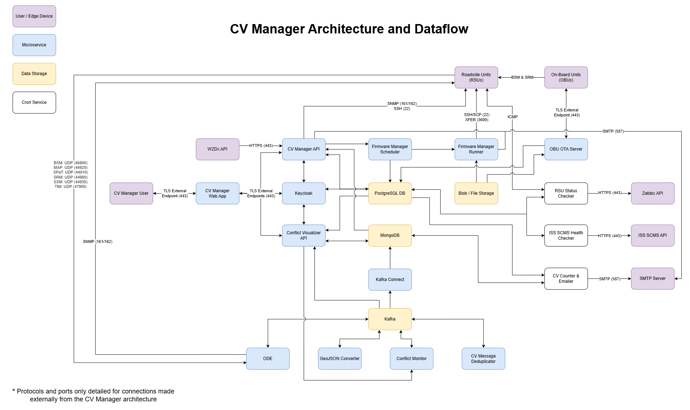

# jpo-cvmanager

**US Department of Transportation (USDOT) Intelligent Transportation Systems (ITS) Joint Program Office (JPO) Connected Vehicle Manager**

The JPO Connected Vehicle Manager is a web-based application that helps an organization manage their deployed CV devices (Roadside Units and Onboard Units) through an interactive, graphical user interface using Mapbox.

**GUI:** ReactJS with Redux Toolkit and Mapbox GL

**API:** Python 3.12.2

**Features:**

- Visualize devices on a Mapbox map
- Display the current statuses of devices
  - Latest online status
  - ISS SCMS certificate expiration
  - Other identifying values tracked on a PostgreSQL database
- jpo-ode supported message counts, sorted by RSU IP (BSM, MAP, SPaT, SRM, SSM, TIM)
- Visualize an RSU's currently active MAP message
- Visualize Basic Safety Messages (BSMs) relative to a specified geofence and time period
- Device configuration over SNMP (v3) for message forwarding including an option to include security headers for NTCIP-1218 devices
- Device firmware upgrade support for Kapsch, Commsignia and Yunex devices
- Admin controls for adding, modifying and removing devices and users
- Fully customizable theming with Material UI - [cvmanager theming documentation](webapp/src/styles/README.md)

To provide feedback, we recommend that you create an "issue" in this repository (<https://github.com/usdot-jpo-ode/jpo-cvmanager/issues>). You will need a GitHub account to create an issue. If you don’t have an account, a dialog will be presented to you to create one at no cost.

## Release Notes

The current version and release history of the JPO CV Manager: [Release Notes](docs/Release_notes.md)

## Requirements and Limitations

The JPO CV Manager was originally developed for the Google Cloud Platform and a few of its GCP dependencies still remain. The GCP dependencies will eventually be streamlined to support other options. However, there are a handful of technologies to understand before attempting to utilize the CV Manager.



### CV Manager Webapp

- Supports OAuth2.0 through Keycloak for user authentication only. It can be configured for several different Identity Providers, including Google.

### CV Manager API

- PostgreSQL database is required. Run the [table creation script to create a to-spec database](resources/sql_scripts).
  - Follow along with the README to ensure your data is properly populated before running the CV Manager.
- GCP BigQuery is required to support J2735 message counts and BSM data. Message counts will be migrated to PostgreSQL eventually, however it is not recommended to store full J2735 messages in a PostgreSQL database. A noSQL database or a database that is specialized for storing big data is recommended. Support for MongoDB is planned to be implemented.
  - It is recommended to create a table for storing J2735 messages, one table per message type (BSM, MAP, SPaT, SRM, and SSM), before running the CV Manager.

### Keycloak

- Keycloak is used for the CV Manager webapp's authentication.
- The Keycloak pod requires a `realm.json` file in the folder: `./resources/keycloak/` to startup with the proper configurations. It also requires a login theme that can be modified and generated using the [keycloakify](https://github.com/keycloakify/keycloakify) forked repository in resources/keycloak/keycloakify. The theme will be automatically generated when using the docker image provided but can also be built using instructions found in the keycloakify folder.
- To migrate an environment from a disconnected keycloak/postgres deployment to using the Keycloak postgres user provider, follow the steps described in [resources/keycloak/README.md](./resources/keycloak/README.md#migration-steps)

### Intersection Data + ConflictMonitor Integration

The CVManager now has the ability to manage, configure, and display data from connected intersections. Using the JPO-ODE ConflictMonitor and other JPO-ODE resources, intersection-specific data can be collected, processed, and analyzed. The CVManager has the ability to display the results of this analysis, show live message data, and configure intersection monitoring. This includes the following:

- Displaying live MAPs, SPATs, and BSMs on a Mapbox map
- Displaying archived MAPs, SPATs, and BSMs on a Mapbox map
- Querying, downloading, and displaying events created by the ConflictMonitor
- Querying, downloading, and displaying assessments of events created by the ConflictMonitor
- Querying, managing, and displaying notifications created by the ConflictMonitor
- Updating and managing configuration parameters controlling message analysis, assessments, and notifications

More information on the ConflictMonitor and other services described above can be found here:

- [jpo-conflictmonitor](https://github.com/usdot-jpo-ode/jpo-conflictmonitor)
- [jpo-geojsonconverter](https://github.com/usdot-jpo-ode/jpo-geojsonconverter)
- [jpo-ode](https://github.com/usdot-jpo-ode/jpo-ode)
- [jpo-conflictvisualizer](https://github.com/usdot-jpo-ode/jpo-conflictvisualizer)

**Ongoing Efforts**
This feature is under active development. This is a joint effort involving combining the features of the existing CIMMS conflictvisualizer tools with the CVManager components, to enable connected vehicle and intersection analysis in one application.

One of the major features which is under active development is the combined CVManager - ConflictVisualizer API. This can currently be found under the services/intersection-api folder.

#### Github Token

A GitHub token is required to pull artifacts from GitHub repositories. This is required to obtain the jpo-ode jars and must be done before attempting to build this repository.

1. Log into GitHub.
2. Navigate to Settings -> Developer settings -> Personal access tokens.
3. Click "New personal access token (classic)".
   1. As of now, GitHub does not support Fine-grained tokens for obtaining packages.
4. Provide the name "jpo_conflictmonitor"
5. Set an expiration date
6. Select the read:packages scope.
7. Click "Generate token" and copy the token.
8. Set this token as the MAVEN_GITHUB_TOKEN environment variable in the .env file (root and ./services/intersection-api/.env)

### Feature Flags

This application has the ability to disable certain features based on environment variables. For each of these variables, the feature will be enabled if the variable is anything but 'false'. These features include:

- ENABLE_RSU_FEATURES: if 'false', disable all RSU-specific features, including map, RSU data, RSU configuration, and RSU organization linking.
- ENABLE_INTERSECTION_FEATURES: if 'false', disable all intersection-specific features, including intersection map, intersection dashboard, and intersection admin pages.
- ENABLE_WZDX_FEATURES: if 'false', disable all wzdx-specific features, including WZDx data on the main map.

These variables will disable UI pages/visuals, UI features, and API endpoints.

#### Local Development

Ease of local development has been a major consideration in the integration of intersection data into the CVManager application. Through the use of public docker images and sample datasets, this process is relatively simple. The services required to show intersection data on the CVManager webapp are:

- kafka
  - Base kafka image used to supply required topics to the intersection api
- kafka-setup
  - Kafka topic creation image, to create required topics for the intersection api
- mongo
  - Base MongoDB image, with sample data, used to supply data to the intersection api
- mongo-setup
  - MongoDB collection creation image, to create required collections for the intersection api

It should be noted that the `kafka`, `kafka-setup`, `mongo` and `mongo-setup` services are provided by the jpo-utils repository.

**Intersection API Submodules**
The Intersection API uses nested submodules for asn1 encoding and decoding [usdot-jpo-ode/asn1_codec](https://github.com/usdot-jpo-ode/asn1_codec) and kafka management. These submodules need to be initialized and updated before the API can be built and run locally. Run the following command to initialize the submodules:

```sh
git submodule update --init --recursive
```

**Running a Simple Local Environment**

Build the docker-compose:

```sh
docker compose up -d
```

If any issues occur, try re-building all images, with:

```sh
docker compose up --build -d
```

**Re-generating ConflictMonitor Sample Data**

A set of data dumps exists in the [./resources/mongodumps](./resources/mongodumps) folder, which can each be automatically injected into MongoDB using the `MONGO_SAMPLE_DATA_RELATIVE_PATH` environment variable, such as `MONGO_SAMPLE_DATA_RELATIVE_PATH=../resources/mongodumps/dump_2025_07_21`.

To create a new sample dataset, simply follow the below steps, and see the sample commands below the steps.

1. Configure MongoDB to not restore any data on boot by leaving the env var `MONGO_SAMPLE_DATA_RELATIVE_PATH` blank
2. Clear all existing docker volumes

```sh
docker compose down -v
```

3. Bring up the cv-manager including the conflictmonitor components with the env var `COMPOSE_PROFILES=basic,webapp,intersection,conflictmonitor,mongo_full,kafka_full,kafka_connect_standalone`

```sh
docker compose up -d
```

4. Clone the [ConflictMonitor repository](https://github.com/usdot-jpo-ode/jpo-conflictmonitor) and run the [test-message-sender](https://github.com/usdot-jpo-ode/jpo-conflictmonitor/blob/develop/test-message-sender/README.md) to generate sample data
   1. If data is not being sync'd to mongodb, ensure that you have set your env var `CONNECT_URL=http://${DOCKER_HOST_IP}:8083`

```sh
git clone https://github.com/usdot-jpo-ode/jpo-conflictmonitor
cd jpo-conflictmonitor/test-message-sender/script-runner
mvn clean install
cd ../
java -jar ./script-runner/target/script-runner-cli.jar ../jpo-conflictmonitor/scripts/IntegrationTestScripts/ConnectionOfTravel-u-turn.csv
```

5. Export the newly generated data to create a new dump of the MongoDB database

```sh
cd ../../jpo-cvmanager
# Update the username and password to match your MongoDB instance (MONGO_READ_WRITE_USER and MONGO_READ_WRITE_PASSWORD)
docker exec -it jpo-cvmanager-mongo-1 mongodump --db CV --out /dump --username=ode --password=replace_me --authenticationDatabase admin
# This command requires an unix shell - if running in powershell, replace `$(date +%Y_%m_%d)` with `$formattedDate` where `$formattedDate = Get-Date -Format "yyyy_MM_dd"`.
docker cp jpo-cvmanager-mongo-1:/dump ./resources/mongodumps/dump_$(date +%Y_%m_%d)
```

6. Update your `MONGO_SAMPLE_DATA_RELATIVE_PATH` in the `.env` file to point to the new dump folder and restart the docker compose to use the new data dump:
   1. e.x. `MONGO_SAMPLE_DATA_RELATIVE_PATH=../resources/mongodumps/dump_2025_07_21`

```sh
docker compose up -d
```

#### MongoDB

MongoDB is the backing database of the intersection api. This database holds configuration parameters, archived data (SPATs, MAPs, BSMs, ...), and processed data (notifications, assessments, events). For local development, a mongodump has been created in the conflictmonitor/mongo/dump_2024_08_20 directory. This includes notifications, assessments, events, as well as SPATs, MAPs, and BSMs. All of this data is available through the intersection api. To disable starting the mongo container with sample data, set the INSERT_SAMPLE_DATA environment variable to `false` in the .env file.

#### Kafka

Kafka is used by the intersection api to receive data from the ODE, GeoJSONConverter, and ConflictMonitor. These connections enable live intersection data to be streamed from the ConflictMonitor into the cvmanager intersection map.

#### Generating Sample Data

Some simple sample data is injected into the MongoDB instance when created. If more data is useful, the test-message-sender from the jpo-conflictmonitor can also be used to generate live sample data. This component should be cloned/installed separately, and is described here: [jpo-conflictmonitor/test-message-sender](https://github.com/usdot-jpo-ode/jpo-conflictmonitor/tree/develop/test-message-sender)

## Getting Started

The following steps are intended to help get a new user up and running the JPO CV Manager in their own environment.

1.  Follow the Requirements and Limitations section and make sure all requirements are met.
2.  Run the following command to initialize submodules:
    ```sh
    git submodule update --init --recursive
    ```
3.  Create a copy of the sample.env named ".env" and refer to the Environmental variables section below for more information on each variable.
    1. Make sure at least the DOCKER_HOST_IP, KEYCLOAK_ADMIN_PASSWORD, KEYCLOAK_API_CLIENT_SECRET_KEY, and MAPBOX_TOKEN are set for this.
    2. Some of these variables, delineated by sections, pertain to the [jpo-conflictmonitor](https://github.com/usdot-jpo-ode/jpo-conflictmonitor), [jpo-geojsonconverter](https://github.com/usdot-jpo-ode/jpo-geojsonconverter), and [jpo-ode](https://github.com/usdot-jpo-ode/jpo-ode). Please see the documentation provided for these projects when setting these variables.
4.  The CV Manager has four components that need to be containerized and deployed: the API, the PostgreSQL database, Keycloak, and the webapp.

    - If you are looking to deploy the CV Manager locally, you can simply run the docker-compose, make sure to fill out the .env file to ensure it launches properly. Also, edit your host file ([How to edit the host file](<[resources/kubernetes](https://docs.rackspace.com/support/how-to/modify-your-hosts-file/)>)) and add IP address of your docker host to these custom domains (remove the carrot brackets and just put the IP address):

    CV Manager hosts:

         <DOCKER_HOST_IP> cvmanager.local.com
         <DOCKER_HOST_IP> cvmanager.auth.com

5.  Apply the docker compose to start the required components:

    ```sh
    docker compose up -d
    ```

    If any issues occur, try:

    ```sh
    docker compose up --build -d
    ```

6.  Access the website by going to:

    ```
      http://cvmanager.local.com
      Default Username: test@gmail.com
      Default Password: tester
    ```

7.  To access keycloak go to:

    ```
      http://cvmanager.auth.com:8084/
      Default Username: admin
      Default Password: admin
    ```

- If you are looking to deploy in Kubernetes or on separate VMs, refer to the Kubernetes YAML deployment files to deploy the four components to your cluster. ([Kubernetes YAML](resources/kubernetes))

### Docker Profiles

Docker compose profiles allow for the customization of services that are run. For more information on how this works, see the [Docker Compose Profiles Documentation](https://docs.docker.com/compose/profiles/).
Services and profiles are configured using the COMPOSE_PROFILES environment variable. Multiple profiles may be specified, like COMPOSE_PROFILES=basic,webapp,intersection

In addition to the groups defined in the table below, each service may also be activated independently by specifying the service name as a profile. This can be combined with other service names or profile groups to produce unique combinations of services. For example, the entry COMPOSE_PROFILES=kafka,kafka_init,basic would bring up the kafka services and the basic CV-Manager services. To avoid breaking name changes, the conflictmonitor service can be started individually using the "conflictmonitor_only" profile.

#### Profiles and Services

| Service                            | basic | webapp | intersection | intersection_no_api | conflictmonitor | addons | obu_ota |
| ---------------------------------- | ----- | ------ | ------------ | ------------------- | --------------- | ------ | ------- |
| cvmanager_api                      | ✅    | ❌     | ❌           | ❌                  | ❌              | ❌     | ❌      |
| cvmanager_webapp                   | ❌    | ✅     | ❌           | ❌                  | ❌              | ❌     | ❌      |
| cvmanager_postgres                 | ✅    | ❌     | ❌           | ❌                  | ❌              | ❌     | ❌      |
| cvmanager_keycloak                 | ✅    | ❌     | ❌           | ❌                  | ❌              | ❌     | ❌      |
| intersection_api                   | ❌    | ❌     | ✅           | ❌                  | ❌              | ❌     | ❌      |
| conflictmonitor                    | ❌    | ❌     | ❌           | ❌                  | ✅              | ❌     | ❌      |
| ode                                | ❌    | ❌     | ❌           | ❌                  | ✅              | ❌     | ❌      |
| aem                                | ❌    | ❌     | ❌           | ❌                  | ✅              | ❌     | ❌      |
| adm                                | ❌    | ❌     | ❌           | ❌                  | ✅              | ❌     | ❌      |
| geojsonconverter                   | ❌    | ❌     | ❌           | ❌                  | ✅              | ❌     | ❌      |
| deduplicator                       | ❌    | ❌     | ❌           | ❌                  | ✅              | ❌     | ❌      |
| connect                            | ❌    | ❌     | ❌           | ❌                  | ✅              | ❌     | ❌      |
| jpo_count_metric                   | ❌    | ❌     | ❌           | ❌                  | ❌              | ✅     | ❌      |
| rsu_status_check                   | ❌    | ❌     | ❌           | ❌                  | ❌              | ✅     | ❌      |
| jpo_iss_health_check               | ❌    | ❌     | ❌           | ❌                  | ❌              | ✅     | ❌      |
| firmware_manager_upgrade_scheduler | ❌    | ❌     | ❌           | ❌                  | ❌              | ✅     | ❌      |
| firmware_manager_upgrade_runner    | ❌    | ❌     | ❌           | ❌                  | ❌              | ✅     | ❌      |
| jpo_ota_backend                    | ❌    | ❌     | ❌           | ❌                  | ❌              | ❌     | ✅      |
| jpo_ota_nginx                      | ❌    | ❌     | ❌           | ❌                  | ❌              | ❌     | ✅      |

##### Note on JPO-Utils Profiles

While `kafka`, `kafka-setup`, `mongo`, `mongo-setup`, and `kafka-connect` are not included in the table above, they are required for the intersection API to run. These services
are provided by the jpo-utils repository. To enable these services, you must include the `kafka_full`, `mongo_full`, and `kafka_connect_standalone` profiles.

### Debugging

Note that it is recommended to work with the Python API from a [virtual environment](https://docs.python.org/3/library/venv.html).

#### Setting up a virtual environment from the command line

1. Verify that you have Python 3.12.2 installed on your machine by running the following command:
   ```bash
   python3.12 --version
   ```
   ```cmd
   python --version
   ```
   If you have a different version installed, download and install Python 3.12.2 from the [Python website](https://www.python.org/downloads/).
2. Open a terminal and navigate to the root of the project.
3. Run the following command to create a virtual environment in the project root:
   ```bash
   python3.12 -m venv .venv
   ```
   ```cmd
   python -m venv .venv
   ```
4. Activate the virtual environment:
   ```bash
   source .venv/bin/activate
   ```
   ```cmd
   .venv\Scripts\activate
   ```
5. Install the required packages:
   ```bash
   pip3.12 install -r services/requirements.txt
   ```
   ```cmd
   pip install -r services/requirements.txt
   ```

#### Setting up a virtual environment with VSCode

See [Visual Studio Code](https://code.visualstudio.com/docs/python/environments) documentation for information on how to set up a virtual environment with VS Code.

#### Debugging Profile

A debugging profile has been set up for use with VSCode to allow ease of debugging with this application. To use this profile, simply open the project in VSCode and select the "Debug" tab on the left side of the screen. Then, select the "Debug Solution" profile and click the green play button. This will spin up a postgresql instance as well as the keycloak auth solution within docker containers. Once running, this will also start the debugger and attach it to the running API container. You can then set breakpoints and step through the code as needed.

For the "Debug Solution" to run properly on Windows 10/11 using WSL, the following must be configured:

1.  In a Powershell or Command Prompt terminal run the command: `ifconfig` and open up your `C:\Windows\System32\drivers\etc\hosts` file

    - Copy the `Ethernet adapter vEthernet (WSL) -> IPv4 Address` value to your hosts `cvmanager.auth.com` entry.
    - In the same hosts file, update the `cvmanager.local.com` value to: `127.0.0.1`.

2.  Update your main .env file variables as specified in the root of the cvmanager directory

    - Copy the `Ethernet adapter vEthernet (Default) -> IPv4 Address` value to your hosts `WEBAPP_HOST_IP` variable

3.  Apply the docker compose to start the required components:

```sh
docker compose up -d
```

To run only the critical cvmanager components (no intersection services), use this command:

```sh
docker compose up -d cvmanager_api cvmanager_webapp cvmanager_postgres cvmanager_keycloak
```

4.  Access the website by going to:

    ```
      http://cvmanager.local.com
      Default Username: test@gmail.com
      Default Password: tester
    ```

5.  To access keycloak go to:

    ```
      http://cvmanager.auth.com:8084/
      Default Username: admin
      Default Password: admin
    ```

### Environment Variables

<b>Generic Variables</b>

- DOCKER_HOST_IP: Set with the IP address of the eth0 port in your WSL instance. This can be found by installing networking tools in wsl and running the command `ifconfig`
- WEBAPP_HOST_IP: Defaults to DOCKER_HOST_IP value. Only change this if the webapp is being hosted on a separate endpoint.
- KC_HOST_IP: Defaults to DOCKER_HOST_IP value. Only change this if the webapp is being hosted on a separate endpoint.

<b>Webapp Variables</b>

- MAPBOX_TOKEN: A token from Mapbox used to render the map in the Webapp. The free version of Mapbox works great in most cases.
- WEBAPP_DOMAIN: The domain that the webapp will run on. This is required for Keycloak CORS authentication.
- API_URI: The endpoint for the CV manager API, must be on a Keycloak Authorized domain.
- COUNT_MESSAGE_TYPES: List of CV message types to query for counts.
- VIEWER_MSG_TYPES: List of CV message types to query geospatially.
- DOT_NAME: The name of the DOT using the CV Manager.
- MAPBOX_INIT_LATITUDE: Initial latitude value to use for MapBox view state.
- MAPBOX_INIT_LONGITUDE: Initial longitude value to use for MapBox view state.
- MAPBOX_INIT_ZOOM: Initial zoom value to use for MapBox view state.

<b>API Variables</b>

- COUNTS_MSG_TYPES: Set to a list of message types to include in counts query. Sample format is described in the sample.env.
- MONGO_PROCESSED_BSM_COLLECTION_NAME: The collection name in MongoDB for processed BSM messages.
- MONGO_PROCESSED_PSM_COLLECTION_NAME: The collection name in MongoDB for processed PSM messages.
- MONGO_SSM_COLLECTION_NAME: The database name for SSM visualization data.
- MONGO_SRM_COLLECTION_NAME: The database name for SRM visualization data.
- FIRMWARE_MANAGER_ENDPOINT: Endpoint for the firmware manager deployment's API.
- CSM_EMAIL_TO_SEND_FROM: Origin email address for the API error developer emails.
- CSM_EMAILS_TO_SEND_TO: Destination email addresses for the API error developer emails.
- CSM_EMAIL_APP_USERNAME: Username for the SMTP server.
- CSM_EMAIL_APP_PASSWORD: Password for the SMTP server.
- CSM_TARGET_SMTP_SERVER_ADDRESS: Destination SMTP server address.
- CSM_TARGET_SMTP_SERVER_PORT: Destination SMTP server port.
- API_LOGGING_LEVEL: The level of which the CV Manager API will log. (DEBUG, INFO, WARNING, ERROR)
- CSM_TLS_ENABLED: Set to "true" if the SMTP server requires TLS.
- CSM_AUTH_ENABLED: Set to "true" if the SMTP server requires authentication.
- WZDX_ENDPOINT: WZDX datafeed endpoint.
- WZDX_API_KEY: API key for the WZDX datafeed.
- GOOGLE_ACCESS_KEY_NAME: The required Google environment variable for authenticating with Google Cloud.
- GCP_PROJECT_ID: The Google Cloud project ID for which the service account associated with GOOGLE_ACCESS_KEY_NAME is for.
- MOOVE_AI_SEGMENT_AGG_STATS_TABLE: The BigQuery table name for Moove.Ai's segment aggregate statistics.
- MOOVE_AI_SEGMENT_EVENT_STATS_TABLE: The BigQuery table name for Moove.Ai's segment event statistics.
- TIMEZONE: Timezone to be used for the API.
- GOOGLE_APPLICATION_CREDENTIALS: Path to the GCP service account credentials file. Attached as a volume to the CV manager API service.

<b>PostgreSQL Variables</b>

- PG_DB_HOST: The database host, must include the port (normally hostname:5432). Defaults to DOCKER_HOST_IP:5432 but can be configured to a separate endpoint.
- PG_DB_USER: The database user that will be used to authenticate the cloud function when it queries the database.
- PG_DB_PASS: The database user's password that will be used to authenticate the cloud function.
- INSTANCE_CONNECTION_NAME: The connection name for the Cloud SQL instance. (project-id:region:name)

<b>MongoDB Variables</b>

#### For Windows Users Only

If running on Windows, please make sure that your global git config is set up to not convert end-of-line characters during checkout.

Disable `git core.autocrlf` (One Time Only)

```bash
git config --global core.autocrlf false
```

- MONGO_DB_URI: URI for the MongoDB connections.
- INSERT_SAMPLE_DATA: If true, sample data will be inserted in the CVCounts, V2XGeoJson, and OdeSsmJson collections

<b>Keycloak Variables</b>

- KEYCLOAK_DOMAIN: Domain name that Keycloak will be served on.
- KEYCLOAK_ADMIN: Admin username for Keycloak configuration.
- KEYCLOAK_ADMIN_PASSWORD: Admin password for Keycloak configuration.
- KEYCLOAK_ENDPOINT: Keycloak base URL to send requests to. Reference the sample.env for the URL formatting.
- KEYCLOAK_REALM: Keycloak Realm name.
- KEYCLOAK_GUI_CLIENT_ID: Keycloak GUI client name (unauthorized client)
- KEYCLOAK_API_CLIENT_ID: Keycloak API client name.
- KEYCLOAK_API_CLIENT_SECRET_KEY: Keycloak API secret for the given client name.
- KEYCLOAK_LOGIN_THEME_NAME: Name of the jar file to use as the theme provider in Keycloak. For generating a custom theme reference the [Keycloakify](https://github.com/CDOT-CV/keycloakify-starter) Github
- KC_LOGGING_LEVEL: The level of which the Keycloak instance will log. (ALL, DEBUG, ERROR, FATAL, INFO, OFF, TRACE, and WARN)
- GOOGLE_CLIENT_ID: GCP OAuth2.0 client ID for SSO Authentication within keycloak.
- GOOGLE_CLIENT_SECRET: GCP OAuth2.0 client secret for SSO Authentication within keycloak.

Environment variables from addon services can also be set in the main `.env` file. These variables are defined in their own `README` files in the `services/addons/images` location of this repository.

#### Line Endings

This project utilizes a [.gitattributes](.gitattributes) file to normalize line endings for all files. This applies to all new files. To re-run this normalization on existing files, use the following command:

```sh
git add --renormalize .
git commit -m "Re-normalize line endings"
```

On Windows, Disable `git core.autocrlf` (One Time Only)

```bash
git config --global core.autocrlf false
```

## License Information

Licensed under the Apache License, Version 2.0 (the "License"); you may not use this
file except in compliance with the License.
You may obtain a copy of the License at <http://www.apache.org/licenses/LICENSE-2.0>
Unless required by applicable law or agreed to in writing, software distributed under
the License is distributed on an "AS IS" BASIS, WITHOUT WARRANTIES OR CONDITIONS OF ANY KIND, either expressed or implied. See the License for the specific language governing
permissions and limitations under the [License](http://www.apache.org/licenses/LICENSE-2.0).
