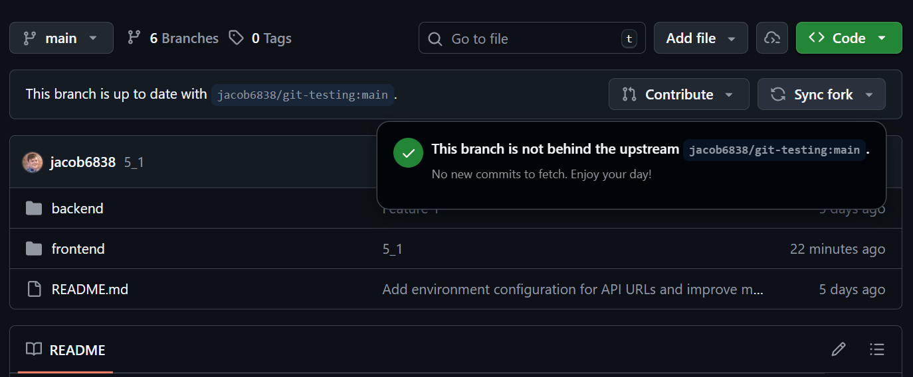
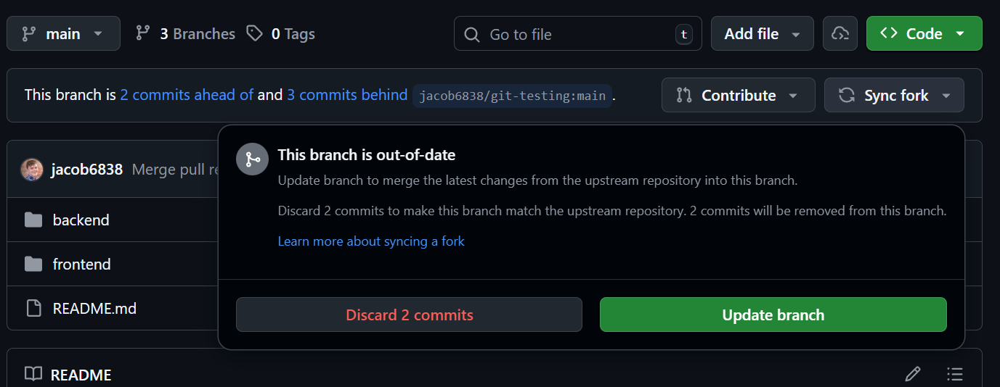
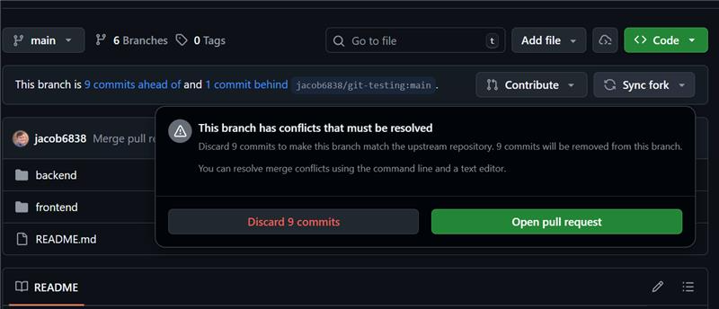

# CV Manager Developer Best Practices

## Managing Fork Synchronization

The majority of the CV-Manager development is completed on forks. This process enables development within a controlled environment. One major consideration is how often to synchronize with the upstream repository. The current recommended approach is to develop features within a fork, and contribute/push sets of features to the upstream repository (in this case, USDOT).

### Upstream ahead of current

When changes exist on the upstream repository which are not present on the current repository, the "Sync Fork" button can be used to bring those changes into the downstream repository. This can show 3 different menus depending on the diff:

#### No changes present



1. No actions necessary, fork is in sync with upstream

#### Changes present, no conflicts



- Changes can be merged without review
- If you press "Update Branch", GitHub will merge the upstream commits into the current repository immediately, without creating a PR. This is the preferred approach
- If you would like to create a PR instead, please see [Changes present, conflicts](#changes-present-conflicts)
- WARNING: If you press "Discard N commits", all local commits not present on the upstream repository will be removed. This process is instant and without additional confirmation. See the steps below for completing this process safely

        1. Create a copy of the current branch (henceforth assumed to be develop). The naming convention is "history/2025_q3" for a major release, or "history/2025_12_31" for date-based
        2. Navigate back to the develop branch, hit "Sync fork", and hit "Discard N commits"
        3. Clone the repository. If the repository is already cloned, checkout the develop branch (the one you discarded the commits on) and run the following command (swap out develop if the branch has a different name)

        ```sh
        git reset --hard origin/develop
        ```

        4. Copy the history branch to a new branch (named something like "develop-rebase-2025_12_31")
        5. Rebase develop into your new branch
        ```
        git rebase develop
        ```
        6. Resolve merge conflicts
        7. Create a PR to merge the new branch changes into the default branch

#### Changes present, conflicts



- Github has detected that the upstream branch cannot be merged into the current branch without conflicts. The PR that it offers to create is from the current branch into the upstream repository, which is the opposite direction of what we want. We want to resolve the conflicts on our fork, then push up the cleaned up changes at a later date. See the next bullet for instructions on how to create a PR from the upstream branch to the current/default branch
- To create a PR from the upstream repo to yours, fill in the following url:
  - https://github.com/{your-organization or user}/{repo name}/compare/{default branch}...{upstream org name}:{repo name}:{default branch}
  - Example: https://github.com/cdot-cv/jpo-cvmanager/compare/develop...usdot-jpo-ode:jpo-cvmanager:develop
- See the section above for a description of the "Discard N commits" button function

## Pull Requests

Pull requests should be kept to a manageable size, able to be reviewed within 1-2 hours. An ideal PR should be under 400 lines of code changed, with an upper limit of 1000 lines of code changed (using the guideline of 500 lines per hour). If a PR exceeds this size, consider breaking it up into multiple smaller PRs. Exceptions can be made for lines which are auto-generated.

For more information on PR best practices, see [best-practices-for-peer-code-review](https://smartbear.com/learn/code-review/best-practices-for-peer-code-review)

When creating a pull request, use the provided [pull request template](../pull_request_template.md). This ensures that all necessary information is provided for reviewers.

### Squash Merge

All pull requests should be squash merged into develop. This ensures that we have a history of feature additions without the noise of intermediate commits.

When making a squash merge, both a message and a description are included. The message should be concise and accurate (this is what is seen first when scrolling through previous commits). This should resemble the PR title.
The extended description should describe important details about the feature including the distinct changes involved and the affected services. This should resemble the PR description.

#### Synchronizing after a squash commit

When a squash merge or squash commit is executed, multiple previous commits are replaced by a single squash commit. For any branches which still have the non-squished commits, they need to be synchronized.

Checkout develop and check for pending changes.

```sh
git checkout develop
git status
```

Ensure there are no pending changes. If there are any changes present, commit/stash them on a feature branch. The next command will delete all pending changes and re-set the history of your local develop to the remote develop

```sh
git reset --hard origin/develop
```

The recommended approach for synchronizing feature branches after a squash is a [merge](https://git-scm.com/book/en/v2/Git-Branching-Basic-Branching-and-Merging). This will pull commits from the source branch into the feature branch, _retaining the un-squashed commits_, while presenting all merge conflicts in 1 wave. These additional un-squashed commits will be removed on the next squash merge into develop.

```sh
git checkout feature-branch
git merge origin/develop
```

If removing the un-squashed commits is a priority, consider using a [rebase](https://git-scm.com/book/ms/v2/Git-Branching-Rebasing). This will _remove all of the un-squashed commits_, then go through the new commits and re-apply them to the updated history. Each step can have it's own merge conflicts, which can be extremely burdensome for large offsets, and each of the new commits will be re-applied, which will change their commit hashes. This can be a risky process, so ensure that the feature branch is backed up before proceeding.

```sh
git checkout feature-branch
git rebase develop
```
