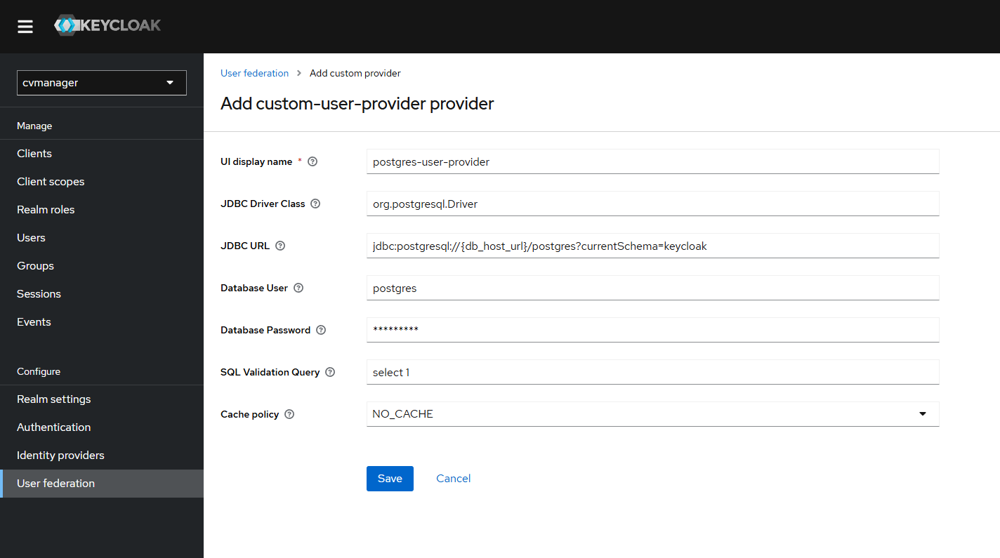

# Keycloak Configuration

## Realm Configuration

The `realm.json` file included in this project initializes Keycloak with a sample configuration for the `cvmanager` realm. This includes creating a test user with the below credentials:

- **Email:** `test@gmail.com`
- **Password:** `tester`

## Keycloak Theme

A sample keycloak theme is provided in the `sample_theme.jar` file. This is a sample theme generated using [Keycloakify](https://github.com/CDOT-CV/keycloakify-starter), to use a custom theme put a generated .jar file in this directory and then update the `KEYCLOAK_LOGIN_THEME_NAME` with the name of the new .jar file.

## Migration Steps

This section describes the steps required to add this custom user provider to an existing cvmanager deployment. These steps will assume that there is existing user data in the postgres public.users table. If these steps aren't followed correctly, user data will not be linked correctly between postgres and keycloak, and may require more manual steps to re-link.

1. Deploy the updated keycloak image
   - This will add the custom-user-provider and custom-protocol-mappers, by won't deploy them if you don't wipe the postgresql volume. That is good, we don't want the custom-user-provider enabled right now
2. Update the postgres public.users table definition by running the following script in postgres: [user_provider_table_update.sql](../sql_scripts/update_scripts/user_provider_table_update.sql)
3. In the Keycloak admin console, delete all of the google-idp provided users
   - For google-authenticated users, there is no necessary information stored here
4. Complete the following steps for keycloak-authenticated users:
   - For each user, look up their keycloak ID. This is found on the user details page in the keycloak admin console:
     
   - Update the public.users keycloak_id for each user, to be the retrieved keycloak ID value. This will enable keycloak to link the credentials after the user is pulled from postgres by the postgres user provider
5. In the Keycloak admin console, under the User federation tab, add the custom-user-provider provider
   - 
   - Enter the following data:
     | Property | Value |
     |---------------------|------------------------------|
     | UI display name | postgres-user-provider |
     | JDBC Driver Class | org.postgresql.Driver |
     | JDBC URL (include port if required) | jdbc:postgresql://_{db_host_url}_/postgres?currentSchema=keycloak |
     | Database User | _{database username}_ |
     | Database Password | _{database password}_ |
     | SQL Validation Query | select 1 |
     | Cache policy | NO_CACHE |
   - 
   - Confirm functionality by searching the Users (enter \*)
6. Add the custom token mapper
   - In the Keycloak admin console, under the Clients tab, select the cvmanager_gui client
   - Under the Client scopes tab, select the cvmanager_gui_dedicated client scope
   - Select "Configure a new mapper"
   - Select "Custom Token Mapper"
   - Enter the following data:
     | Property | Value |
     |---------------------|------------------------------|
     | Mapper Type | Custom Token Mapper |
     | Name | postgres-role-token-mapper |
     | Token Claim Name | postgres_role_token_claim |
     | Add to ID token | true |
     | Add to access token | true |
     | Add to userinfo | false |
   - 
7. Modify the google IDP authentication flow
   - In the Authentication tab, select the "first broker login" flow
   - under the Action tab (top left), select "Duplicate". Enter the following information:
     | Property | Value |
     |---------------------|------------------------------|
     | Name | Google duplicate first broker login |
     | Description | Actions taken after first broker login with identity provider account, which is not yet linked to any Keycloak account. This flow is modified to remove authentication from the account linking process, as postgres-provided users have no credentials set |
   - hit "Duplicate"
   - Remove all steps under "Google duplicate first broker login Handle Existing Account"
   - On "Google duplicate first broker login Handle Existing Account", hit the + and Add Step
   - Select "Automatically set existing user" and Add
   - Set the "Automatically set existing user" Requirement dropdown to "Required"
   - Confirm that your Google duplicate first broker login flow looks like the image below:
   - 
   - Navigate to the Identity Providers tab, select "google"
   - Under Advanced Settings, change the "First login flow" to "Google duplicate first broker login"
8. Complete
   - Now, users can login through the google IDP, and their newly-created keycloak identities will be automatically linked to their existing postgres information!
   - In the future, consider reverting the changes to the first broker login authentication flow
