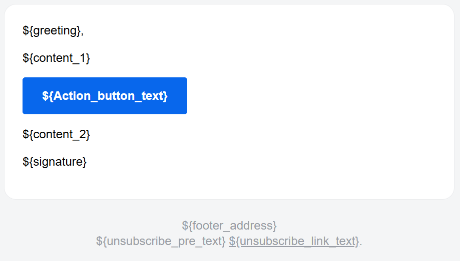

# Email Templates

## Default Email Template

| Placeholder           | Description                                                | Sample Value                                             |
| --------------------- | ---------------------------------------------------------- | -------------------------------------------------------- |
| head_title            | The title of the html head feature, not directly displayed | "New Announcement"                                       |
| preview_text          | The text that appears in the email preview                 | "Check out our latest announcement!"                     |
| greeting              | The greeting line of the email                             | "Hello,"                                                 |
| content_1             | The first paragraph of the email content                   | "We are excited to announce..."                          |
| action_button_text    | The text on the action button                              | "Learn More"                                             |
| action_button_href    | The URL the action button links to                         | "https://example.com/announcement"                       |
| content_2             | The second paragraph of the email content                  | "Thank you for your continued support."                  |
| signature             | The closing signature of the email                         | "Thank You,\nThe CV-Manager Team"                        |
| footer_address        | The address displayed in the footer                        | "1234 Example St, City, Country"                         |
| unsubscribe_pre_text  | The text before the unsubscribe link                       | "If you no longer wish to receive these emails, you can" |
| unsubscribe_link_text | The text for the unsubscribe link                          | "Unsubscribe"                                            |
| unsubscribe_href      | The URL for the unsubscribe link                           | "https://example.com/unsubscribe"                        |
