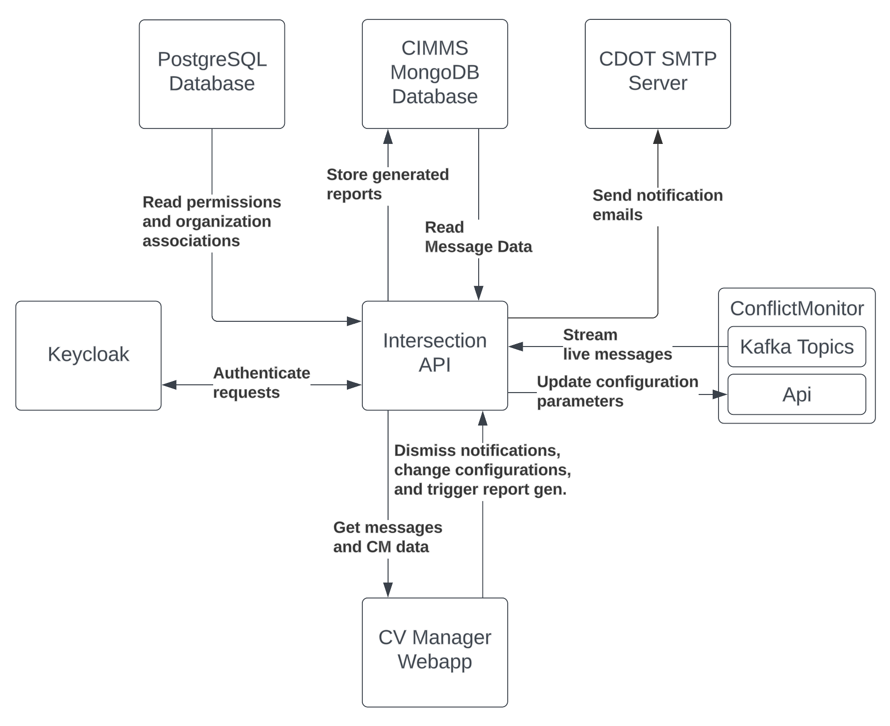

# Intersection API Documentation

This directory contains documentation about the Intersection api. This API was created as a fork of the [CIMMS ConflictVisualizer Api](https://github.com/usdot-jpo-ode/jpo-conflictvisualizer/tree/cvmgr-cimms-integration/api).

All of the data flowing into and out of the intersection api is shown in the following dataflow diagram:

## Intersection API Swagger Docs

To view the endpoint configuration of the api, open the following HTML page in a browser: [docs/Intersections/swagger-docs/docs.html](swagger-docs/docs.html)

For more information on how to generate/update this documentation, please see [swagger-docs](./swagger-docs/README.md)

## The CIMMS Project

The Connection Intersection Message Monitoring System (CIMMS) was developed to automatically monitor connected intersections, for the purpose of ensuring that those intersections are functioning correctly over long periods of time. For more information on this project, see the following documents:

- [CIMMS_Overview.pptx](CIMMS_Overview.pptx)
  - Overview of the CIMMS project, from goals to results
- [CIMMS_Software_Design.pdf](CIMMS_Software_Design.pdf)
  - CIMMS design documentation, including definitions of event, assessment, and notification types
- [CIMMS_System_Requirements.pdf](CIMMS_System_Requirements.pdf)
  - CIMMS project system requirements document
- [CV_PFS_CIMMS_ConOps.pdf](CV_PFS_CIMMS_ConOps.pdf)
  - CIMMS ConOps document
