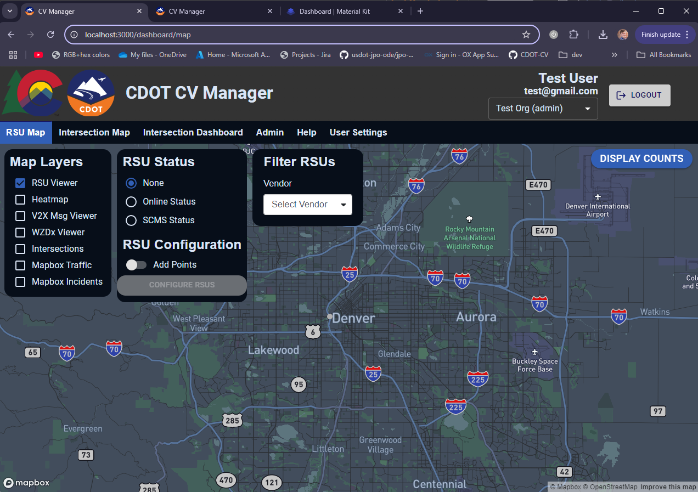
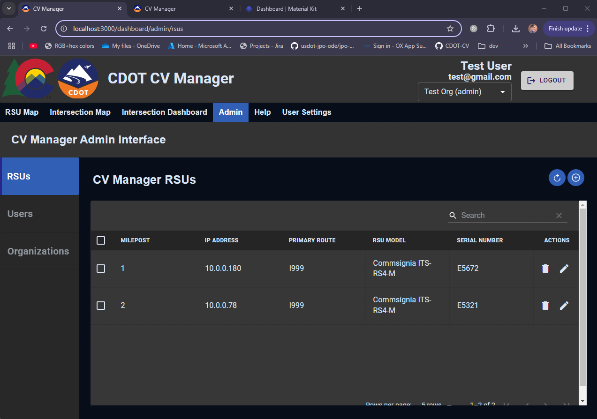
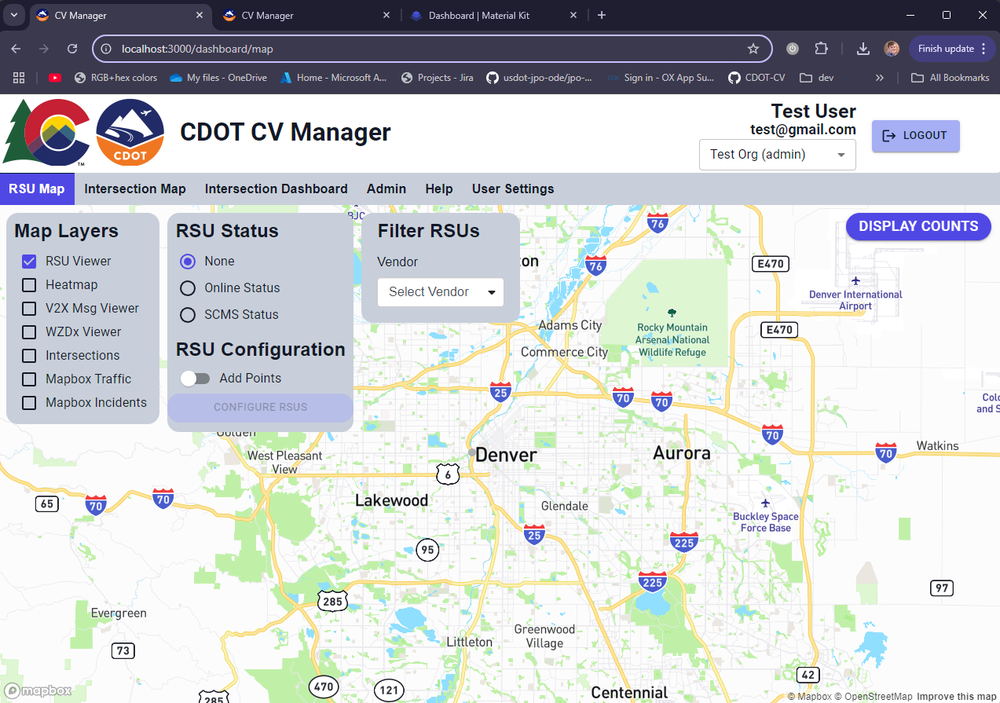
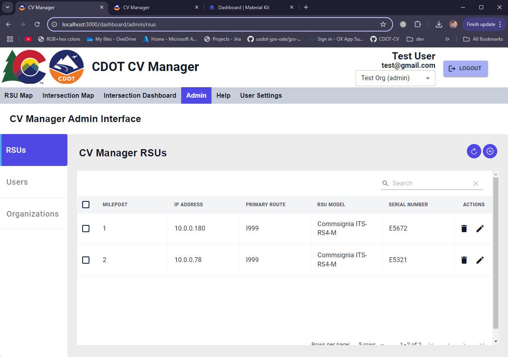

# CVManager Theming

The CVManager natively supports 2 different themes: dark and light. Examples of each theme are shown below:

| Theme      | Map View                                                                       | Admin View                                                                         |
| ---------- | ------------------------------------------------------------------------------ | ---------------------------------------------------------------------------------- |
| Main Dark  |    |    |
| Main Light |  |  |

## Light vs Dark

The CVManager is configured to automatically change theme and icons based on the browser being in light vs dark mode. Each of the theme components, the base MUI theme and the icons, have different versions for light and dark. If you don't want the theme to change with the browser, simply set both to the same theme.

## Themes

As noted above, the two built-in themes are light and dark. Each of these themes has an existing MUI Theme object in [index.ts](./index.ts). These theme objects look as follows:

```ts
const themeMainDark = createTheme({
  //MUI createTheme call, initialize all un-specified values to theme defaults: https://mui.com/material-ui/customization/default-theme/
  components: {
    MuiTableHead: {
      // Custom table headers
      styleOverrides: {
        root: {
          backgroundColor: '#252525', // Custom table headers background color
          borderBottom: 'none',
          '& .MuiTableCell-root': {
            borderBottom: 'none',
            fontSize: '12px',
            fontWeight: 600,
            lineHeight: 1,
            letterSpacing: 0.5,
            textTransform: 'uppercase',
          },
          '& .MuiTableCell-paddingCheckbox': {
            paddingTop: 4,
            paddingBottom: 4,
          },
        },
      },
    },
  },
  palette: {
    mode: 'dark', // Should match general color scheme, slightly changes rendering
    primary: {
      main: '#b55e12', // Primary color, used in icon backgrounds, selected tabs, buttons, checkboxes, ...
      light: '#cecece', // Used as LightButton background (contact support and logout)
      dark: '#e37120', // Highlighted/hovered button backgrounds, used in smaller buttons, admin, toggles. Provides better text contrast than primary.main
      contrastText: '#fff', // Text color with contrast to primary.main and primary.dark colors
    },
    secondary: {
      main: '#0e2052', // Secondary color, used in snmpwalk backgrounds
      light: '#26329f', // Used in snmpwalk hovered backgrounds
      dark: '#0a0f3f', // Used as accent color for selected tab item, snmpwalk  backgrounds, and LightButton text color (contact support and logout)
      contrastText: '#fff',
    },
    error: {
      main: '#FD7C7C', // Text color in RSU firmware and RSU status tables, as well as ErrorMessageText. Background is background.paper
    },
    success: {
      main: '#90EE90', // Text color in RSU firmware and RSU status tables, as well as SuccessMessageText. Background is background.paper
    },
    text: {
      primary: '#ffffff', // Primary text color, used in most text-based components
      secondary: '#eb8841', // Used for Intersection page sub-titles
      disabled: '#acacac', // Used for disabled button text
    },
    custom: {
      mapLegendBackground: '#0e2052', // Used for horizontal tab backgrounds and map control/legend backgrounds
      tableHeaderBackground: '#252525', // Used for Admin table header background color, usually same as components.styleOverrides.root.backgroundColor
      tableErrorBackground: '#4d2e2e', // Background color of admin table rows when there is an error
      mapStyleFilePath: 'mapbox-styles/cdot-dark.json', // path to local mapbox map style.json
      mapStyleHasTraffic: false, // Whether the style contains mapbox traffic and incident layers
    },
    divider: '#111', // Used in dividers (<Divider /> components)
    background: {
      paper: '#333', // Used in table body backgrounds, in-page header backgrounds, and vertical tab background. Also used in Help page background
      default: '#1c1d1f', // Used as default in page backgrounds
    },
  },
})
```

## Icons

The main icon/logo in the CVManager is used in 2 places: the after-login loading/error page, and the main dashboard at the top-left.

The CVManager allows customization of icons when building the application through docker. This is done by hosting the icons as volumes in the running webapp image, to the path container /usr/share/nginx/html/icons/logo_light.png and /usr/share/nginx/html/icons/logo_dark.png (path in repo is webapp/public/icons/logo_light and webapp/public/icons/logo_dark). This is already done in [docker-compose.yml](../../../docker-compose.yml#L79), and is set through the env vars WEBAPP_LOGO_PNG_ROOT_FILE_PATH_LIGHT and WEBAPP_LOGO_PNG_ROOT_FILE_PATH_DARK. These should each be set to the path of a .png image, which can be inside or outside of this repository.

Icons will be locked to 90px high when displayed.
